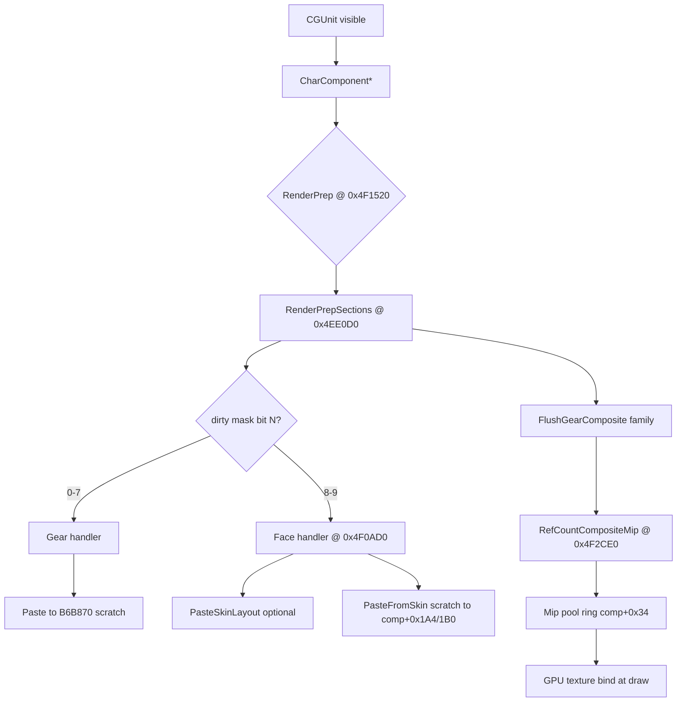

# Client architecture — character composite assemble

WoW 3.3.5a builds the visible player body by compositing BLP layers into CPU mips, then uploading to GPU. Gear recolor hooks the **paste** step; understanding the full pipeline explains why multi-player tint fails.

---

## High-level flow



---

## Storage: one scratch, many components

```
                    ┌──────────────────────────────┐
                    │  *[0x00B6B870]  GEAR SCRATCH │
                    │  (ONE per entire client)     │
                    └──────────────▲───────────────┘
                                   │ sections 0-7 paste
         ┌─────────────────────────┼─────────────────────────┐
         │                         │                         │
   ┌─────▼─────┐             ┌─────▼─────┐             ┌─────▼─────┐
   │ Local CC  │             │ Pool CC 0 │             │ Pool CC N │
   │ B6B1A0    │             │ B6B240    │             │ +0x198*N  │
   │ +0x1A4    │             │ +0x1A4    │             │ +0x1A4    │
   │ +0x1B0    │             │ +0x1B0    │             │ +0x1B0    │
   │ +0x34 pool│             │ +0x34 pool│             │ +0x34 pool│
   └───────────┘             └───────────┘             └───────────┘
        self                   remote A                   remote B
```

**Key insight:** mips at `+0x1A4` are per-component, but **gear assembly always writes the shared scratch first**. Face assembly **reads** that scratch. If player B's gear tint runs while player A's face reads scratch, A wears B's colors.

---

## Section 8 dual path

Handler @ `0x4F0AD0`:

```
TextureCacheHelper(tex)
if !eax → return
test [eax+0x1C], 0x08
jz skip_layout          ; often skips PasteSkinLayout
call PasteSkinLayout(8)   ; layout path → may use B6B870
skip_layout:
PasteFromSkin(8) → [esi+0x1A4], [esi+0x1B0], scratch
```

`skin_layout` log events only fire when `0x4F07D0` is called — **absence does not mean face was skipped**.

---

## Flush always touches face

Even when `sectionDirty` has only bits 0–7:

1. Gear handlers fill `B6B870` with (possibly tinted) pixels.
2. Face handlers **do not run** (bits 8–9 clear).
3. `FlushGearComposite` still calls `RefCountCompositeMip` on `[esi+0x1A4]` and `[esi+0x1B0]`.
4. Face mips become stale / empty → **black face** on self.

Remotes often get `dirty=0x3FF` on first assemble → face + gear same pass → faces OK until `/recolor` interleaving.

---

## WXL invariants (from RE)

Any hook implementation **must** guarantee:

| ID | Invariant |
|----|-----------|
| R1 | Know owner via `comp+0x38` before writing `B6B870` |
| R2 | Only one assemble using `B6B870` at a time during tint |
| R3 | Remote gear tint dirty mask ≤ `0xFF` (never OR `0x300` inside gear pass) |
| R4 | Never apply item `texturecomponents` HSL to `[comp+0x1A4..]` (sections 8–9) |
| R5 | First remote assemble = native untinted (`0x3FF` acceptable once) |
| R6 | `FlushGearComposite` must run per-component with correct scratch state |
| R7 | Do not block native `PasteFromSkin` scratch→face without runtime proof |

Violating R7 caused login blackface (v12–v13).  
Violating R2 caused cross-player bleed (v8–v14).

---

## WXL hook points (experimental module)

| Hook | Address | Purpose |
|------|---------|---------|
| `hkRenderPrep` | `0x4F1520` | Gate tint sessions; set `g_tlsPasteOwner` |
| `hkPasteSkinLayout` | `0x4F07D0` | Observe skin layout; never tint |
| `hkPasteToSection` | `0x4F08A0` | HSL overlay on gear paste |
| `hkTextureCacheGetMip/Pal` | `0x4F2D00` / `0x4F2D40` | Tint overlay read path |
| ~~`hkFlushGearComposite`~~ | ~~various~~ | **Disabled** — mid-entry unsafe |

Tint mechanism: `ArmPasteTintOverlay` patches CPU mip bytes during `GetMip`/`GetPal` for the duration of one `SafeCallPaste`.

---

## Identity resolution chain

```
CGUnit+0xB4  ──must equal──▶  CharComponent+0x38
CGUnit+0x30  ──GUID────────▶  WXL owner key (tint map)
```

Remote pool index: `(CharComponent* - *[B6B240]) / 0x198`

Logs showed **multiple `CharComponent*` per same owner** — pool slot vs active display component mismatch breaks face rebuild targeting.

---

## Further reading

- [`re/WXL-RE-MODEL-ISOLATION-MAP.txt`](../re/WXL-RE-MODEL-ISOLATION-MAP.txt) — R1–R7 expanded
- [`re/WXL-RE-MIP-POOL.txt`](../re/WXL-RE-MIP-POOL.txt) — flush disasm
- [`re/WXL-RE-SECT8-DUAL-PATH.txt`](../re/WXL-RE-SECT8-DUAL-PATH.txt) — face handler
- [`STATUS.md`](STATUS.md) — project outcome
